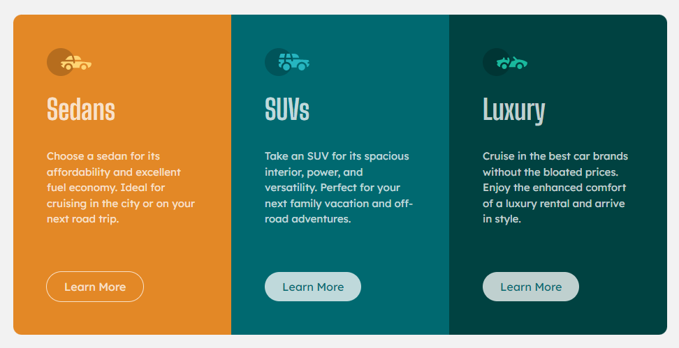
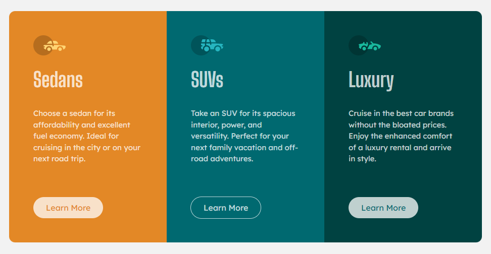
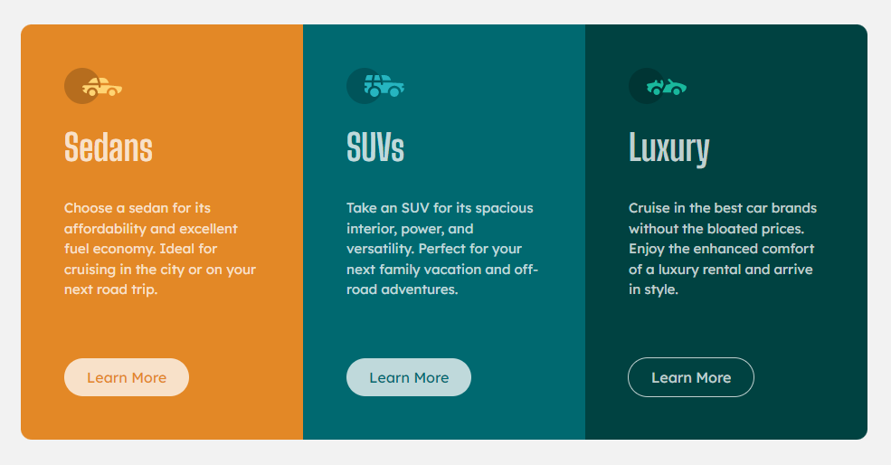
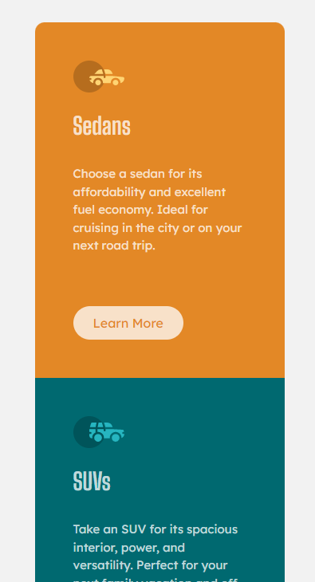

# Frontend Mentor - 3-column preview card component solution

This is a solution to the [3-column preview card component challenge on Frontend Mentor](https://www.frontendmentor.io/challenges/3column-preview-card-component-pH92eAR2-). Frontend Mentor challenges help you improve your coding skills by building realistic projects. 

## Table of contents

- [Overview](#overview)
  - [The challenge](#the-challenge)
  - [Screenshot](#screenshot)
  - [Links](#links)
- [My process](#my-process)
  - [Built with](#built-with)
  - [What I learned](#what-i-learned)
  - [Continued development](#continued-development)
  - [Useful resources](#useful-resources)
- [Author](#author)
- [Acknowledgments](#acknowledgments)

**Note: Delete this note and update the table of contents based on what sections you keep.**

## Overview

### The challenge
This is a challange to create a card component group. It consists of 3 cards with different colors for each card. Each card component consists of an icon, a heading, a paragraph and a button. Also the card group must be responsive.

Users should be able to:

- View the optimal layout depending on their device's screen size
- See hover states for interactive elements

### Screenshot
The following are the screenshots of this components.

- Desktop Preview

- Hover Effect on the button in Sedan card

- Hover Effect on the button in SUV card

- Hover Effect on the button in Luxury card

- Mobile View

### Links

- Solution URL: (https://your-solution-url.com)
- Live Site URL: (https://your-live-site-url.com)

## My process
This is created using Bootstrap 5. First, a container has been added to contain all the card components. It has another container which has three card containers and this container is aligned to the center vertically. This container acts as a row and the card components in it acts as columns. Each card component consists of an icon, a heading, a paragraph and a button. Icons are images and has img-fluid class to be responsive and a padding bottom(pb-4). Headings uses font family "Big Shoulders Display", text color is transparent white and also have a padding bottom(pb-4). The paragraph uses font family "Lexend Deca", text color is transparent white and have padding bottom (pb-4). Bootstrap large buttons are used with a padding on left and right sides(px-4), background color is transparent white and the text color will be same as the color of the card. The buttons have a hover effect which changes the background color to the same as the container and the outline and the text color will be transparent white and the outline will be 1px solid. Since, Bootstrap classes have been used to style the elements, it is responsive.

### Built with

- Semantic HTML5 markup
- CSS custom properties
- Bootstrap 5

### Useful resources

- [Bootstrap 5 Docs](https://getbootstrap.com/docs/5.3/getting-started/introduction/) - This helped me to get the CDNs to use in the project.
- [Bootstrap 5 layout-columns](https://getbootstrap.com/docs/5.3/layout/columns/#how-they-work) - This helped me to understand how to design the rows and columns using Bootstrap classes.

## Author

- Frontend Mentor - (https://www.frontendmentor.io/profile/HarshaVardhanNandamuri)
- Github - (https://github.com/HarshaVardhanNandamuri)

